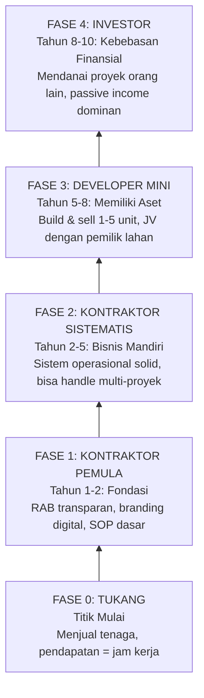

# BAB 1: FONDASI & MINDSET BISNIS

> *"Keberhasilan seorang kontraktor tidak diukur dari seberapa banyak keringat yang tumpah di lapangan, melainkan dari seberapa kokoh SISTEM yang ia bangun."*

---

## Pendahuluan: Mengapa 80% Kontraktor Gagal di Tahun Pertama?

Industri konstruksi adalah arena yang penuh paradoks. Di satu sisi, kebutuhan akan jasa konstruksi terus meningkat seiring pertumbuhan ekonomi dan urbanisasi. Di sisi lain, statistik menunjukkan realitas yang brutal: **sebagian besar kontraktor pemula tumbang di tahun pertama operasional mereka**.

Apakah mereka kalah karena kurang mahir membangun? Tidak. Kebanyakan dari mereka justru adalah tukang-tukang handal yang sangat ahli dalam teknis konstruksi. Masalahnya bukan pada kemampuan memasang bata atau mengaduk semen—**masalahnya ada pada kegagalan membangun BISNIS**.

Bab ini akan membongkar jebakan-jebakan fatal yang menghancurkan kontraktor pemula dan memberikan Anda blueprint untuk bertransformasi dari sekadar "tukang yang sibuk" menjadi "pemilik bisnis konstruksi yang sistematis."

---

## 1.1 Definisi Bisnis Kontraktor: Lebih dari Sekadar Membangun

### Apa Sebenarnya Bisnis Kontraktor?

Kesalahpahaman paling fatal yang dimiliki kontraktor pemula adalah menganggap bahwa **bisnis kontraktor = keahlian membangun**. Ini adalah jebakan berpikir yang akan membuat Anda bekerja seperti kuli seumur hidup.

Mari kita definisikan ulang:

> **Bisnis Kontraktor adalah usaha yang mengelola PROYEK KONSTRUKSI secara sistematis, mulai dari akuisisi klien, perencanaan anggaran, eksekusi lapangan, hingga serah terima—dengan target menghasilkan PROFIT yang terukur dan berkelanjutan.**

Perhatikan kata kuncinya:
- **Mengelola** (bukan mengerjakan sendiri)
- **Sistematis** (bukan asal jalan)
- **Profit terukur** (bukan "semoga ada sisa")
- **Berkelanjutan** (bukan proyek hit-and-run)

### Hierarki Industri Konstruksi

Untuk memahami posisi Anda, pahami dulu hierarki dalam industri ini:

| Level | Peran | Fokus Utama | Sumber Penghasilan | Risiko |
|-------|-------|-------------|-------------------|--------|
| **1** | Tukang (Pekerja) | Eksekusi teknis dengan tangan | Upah harian/borongan | Rendah (hanya tenaga) |
| **2** | Pemborong Kecil | Koordinasi tim kecil | Selisih borongan | Sedang |
| **3** | Kontraktor | Manajemen proyek end-to-end | Margin proyek (10-30%) | Tinggi |
| **4** | Developer | Memiliki proyek sendiri | Capital gain dari aset | Sangat tinggi |

**Pertanyaan kritis:** Di level mana Anda saat ini? Dan di level mana Anda ingin berada dalam 5 tahun ke depan?

---

## 1.2 Lima Penyebab Kegagalan di Tahun Pertama

### Kebocoran #1: Absensi Sistem (Chaos Operasional)

**Gejala:**
- Anda adalah satu-satunya orang yang bisa mengambil keputusan
- HP berdering 20-30 kali sehari untuk urusan sepele
- Proyek terhenti saat Anda sakit atau ada urusan keluarga
- Tim bingung harus berbuat apa tanpa instruksi langsung dari Anda

**Diagnosis:**
Anda adalah *bottleneck*—titik kemacetan dalam bisnis Anda sendiri. Semua keputusan, sekecil apa pun, harus melewati Anda. Ini bukan tanda Anda penting; ini tanda bisnis Anda rapuh.

**Solusi Awal:**
Buat SOP (Standard Operating Procedure) untuk minimal 3 keputusan rutin yang paling sering ditanyakan tim Anda.

---

### Kebocoran #2: Estimasi RAB "Berdasarkan Feeling"

**Gejala:**
- Menentukan harga berdasarkan "harga pasar" tanpa perhitungan detail
- Sering terjadi *nombok* (merugi) di tengah atau akhir proyek
- Tidak tahu pasti berapa HPP (Harga Pokok Proyek) yang sebenarnya
- Mencampur uang proyek dengan uang pribadi

**Diagnosis:**
Anda sedang menjalankan bisnis konstruksi dengan mata tertutup. Tanpa kalkulasi HPP yang presisi, Anda tidak tahu apakah proyek yang Anda ambil menghasilkan profit atau justru menggerus modal Anda.

**Contoh Kasus Nyata:**

> Pak Budi mengambil proyek renovasi rumah senilai Rp 150 juta. Dia merasa ini angka yang "wajar" berdasarkan pengalamannya. Di akhir proyek, setelah dihitung mundur, ternyata total pengeluaran mencapai Rp 145 juta. "Lumayan, untung Rp 5 juta," pikirnya.
>
> Tapi tunggu—dia lupa menghitung:
> - Waktu 2 bulan yang dia habiskan untuk proyek ini
> - Bensin pulang-pergi ke lokasi (60 km PP) setiap hari
> - Pulsa telepon, makan siang, dan "uang rokok" koordinasi
> - Stres dan waktu yang hilang karena mengurus masalah kecil
>
> Jika semua itu dihitung, Pak Budi sebenarnya RUGI. Dia bekerja 2 bulan dengan penghasilan efektif minus.

**Solusi Awal:**
Mulai gunakan template RAB yang memisahkan biaya langsung, biaya tidak langsung, overhead, dan margin profit secara eksplisit.

---

### Kebocoran #3: Manajemen SDM yang Emosional

**Gejala:**
- Mengandalkan tukang "langganan" tanpa kontrak jelas
- Tukang bisa tiba-tiba hilang di tengah proyek
- Kualitas pekerjaan tidak konsisten
- Tidak ada sistem penilaian kinerja atau reward-punishment

**Diagnosis:**
Anda mengandalkan loyalitas personal yang rentan, bukan sistem kontrol yang kokoh. Tukang Anda bukan karyawan loyal; mereka adalah *freelancer* yang selalu mencari penawaran terbaik.

**Solusi Awal:**
Buat sistem sederhana: poin positif untuk kinerja bagus, poin negatif untuk pelanggaran. Akumulasi poin menentukan prioritas panggilan untuk proyek berikutnya.

---

### Kebocoran #4: Asimetri Informasi dengan Klien

**Gejala:**
- Posisi tawar lemah saat negosiasi harga
- Sering diminta revisi tanpa tambahan biaya
- Klien mendikte spesifikasi yang merugikan Anda
- Tidak ada kontrak tertulis yang melindungi

**Diagnosis:**
Tanpa branding yang kredibel dan dokumentasi profesional, Anda dilihat sebagai "tukang" yang bisa ditekan, bukan sebagai "mitra profesional" yang harus dihormati.

**Solusi Awal:**
Siapkan template kontrak standar dengan klausul yang melindungi Anda: scope of work yang jelas, syarat pembayaran berbasis milestone, dan prosedur untuk pekerjaan tambahan (Variation Order).

---

### Kebocoran #5: Akuisisi Klien yang Pasif

**Gejala:**
- 100% klien datang dari referral "mulut ke mulut"
- Tidak ada strategi marketing yang terukur
- Cash flow tidak bisa diprediksi karena proyek tidak terencana
- Panik saat tidak ada proyek, lalu mengambil proyek apapun dengan harga berapapun

**Diagnosis:**
Anda tidak memiliki "mesin akuisisi klien" yang bekerja secara konsisten. Bisnis Anda bergantung pada keberuntungan dan jaringan personal yang terbatas.

**Solusi Awal:**
Buat digital presence sederhana: profil Google Business yang teroptimasi dan akun Instagram yang menampilkan portofolio secara profesional.

---

## 1.3 Mindset Pemilik Bisnis vs Mindset Tukang

### Transformasi Identitas yang Fundamental

Perbedaan antara kontraktor yang sukses dan yang terus berjuang bukan terletak pada keahlian teknis. Perbedaannya ada di **MINDSET** — cara mereka melihat diri sendiri dan bisnis mereka.

| Aspek | Mindset Tukang | Mindset Pemilik Bisnis |
|-------|----------------|----------------------|
| **Fokus Harian** | "Bagaimana menyelesaikan pekerjaan ini?" | "Bagaimana SISTEM saya bisa menyelesaikan pekerjaan ini?" |
| **Pengukuran Sukses** | Banyaknya proyek dikerjakan | Margin profit yang dihasilkan |
| **Respons terhadap Masalah** | Turun tangan langsung menyelesaikan | Menganalisis mengapa masalah terjadi dan memperbaiki sistem |
| **Penggunaan Waktu** | Di lapangan mengawasi pekerjaan | Akuisisi klien baru & optimasi sistem |
| **Pandangan tentang Tim** | "Saya harus mengawasi mereka terus" | "Bagaimana mereka bisa bekerja mandiri dengan SOP?" |
| **Finansial** | Ambil sisa uang di akhir proyek | Kunci profit di awal melalui RAB yang presisi |

### Tiga Transformasi Mindset yang Wajib Dilakukan

**1. Dari "Mengawasi Paku" → "Mengawasi Profit"**

Setiap jam yang Anda habiskan untuk mengawasi detail teknis adalah jam yang hilang untuk aktivitas bernilai tinggi: akuisisi klien baru, negosiasi dengan supplier, atau optimasi sistem. Belajarlah untuk mendelegasikan pengawasan teknis kepada mandor yang kompeten.

**2. Dari "Kerja Keras Sendiri" → "Kerja Sistematis"**

Kebanggaan "mengerjakan semuanya sendiri" adalah musuh pertumbuhan. Bisnis yang sehat adalah bisnis yang bisa berjalan tanpa kehadiran fisik Anda secara terus-menerus. Ini bukan berarti Anda malas—ini berarti Anda sudah membangun sistem yang bekerja untuk Anda.

**3. Dari "Semoga Untung" → "Untung yang Dirancang"**

Profit bukan hasil keberuntungan atau sisa uang di akhir proyek. Profit adalah hasil dari perancangan yang presisi sejak awal. Jika kalkulasi RAB tidak menunjukkan margin yang sehat, JANGAN AMBIL PROYEK TERSEBUT.

---

## 1.4 Strategi Tangga Naik: Tukang → Kontraktor → Developer

### Roadmap Evolusi Karir 10 Tahun

Inilah peta perjalanan dari tukang bangunan menjadi pengusaha properti:

### Detail Setiap Fase

**FASE 0: Tukang (Titik Awal)**
- Penghasilan: Upah harian Rp 150.000 - 250.000
- Karakteristik: Pendapatan berhenti saat tidak bekerja
- Skill utama: Keahlian teknis konstruksi

**FASE 1: Kontraktor Pemula (Tahun 1-2)**
- Target: Menguasai RAB modular, membangun branding digital, SOP komunikasi
- Fokus: Membangun reputasi dan kepercayaan klien
- Risiko: Cash flow masih rentan, sistem belum matang
- Milestone: Menyelesaikan 5-10 proyek dengan profit positif yang terukur

**FASE 2: Kontraktor Sistematis (Tahun 2-5)**
- Target: Tim mini yang solid, bisa handle 2-3 proyek paralel
- Fokus: Optimasi sistem, delegasi, dan scaling
- Risiko: Overstretching sumber daya
- Milestone: Bisnis bisa berjalan 1-2 minggu tanpa kehadiran langsung Anda

**FASE 3: Developer Mini (Tahun 5-8)**
- Target: Membangun dan menjual 1-5 unit properti sendiri
- Fokus: Akuisisi lahan (JV/HGB), pemasaran unit
- Risiko: Modal besar, risiko pasar
- Milestone: Capital gain dari 1 proyek developer sukses

**FASE 4: Investor (Tahun 8-10)**
- Target: Multiple stream of income, passive income dominan
- Fokus: Mendanai proyek orang lain, aset sewa
- Risiko: Diversifikasi investasi
- Milestone: Financial freedom—bisnis menghasilkan uang tanpa keterlibatan aktif Anda

---

## 1.5 Fondasi "Lean but Trustworthy"

### Modal Utama Bukan Uang, Tapi Kepercayaan

Kesalahan besar kontraktor pemula adalah berpikir bahwa mereka butuh modal besar untuk memulai: kantor mewah, alat berat sendiri, atau armada kendaraan. Semua itu adalah **beban biaya tetap (fixed cost)** yang bisa membunuh cash flow Anda sebelum bisnis sempat berjalan.

> **Prinsip "Lean but Trustworthy":**
> 
> *"Otoritas Anda tidak ditentukan oleh seberapa banyak alat yang Anda miliki, melainkan oleh seberapa aman klien merasa saat menyerahkan uangnya kepada Anda—karena sistem Anda transparan dan profesional."*

### Modal Non-Uang yang Wajib Dimiliki

Berikut adalah "aset tak berwujud" yang harus Anda bangun sebelum mengejar proyek besar:

**1. Template Dokumen Profesional**
- [ ] Surat Penawaran Harga (Quotation)
- [ ] Kontrak Kerja dengan Scope of Work detail
- [ ] Berita Acara Serah Terima
- [ ] Form Variation Order
- [ ] Invoice dan Kwitansi

**2. Sistem RAB Modular**
- [ ] Template RAB berbasis modul pekerjaan (struktur, dinding, atap, finishing, MEP)
- [ ] Database harga material yang selalu di-update
- [ ] Formula otomatis untuk menghitung HPP dan margin

**3. SOP Komunikasi & Reporting**
- [ ] Alur pelaporan harian/mingguan ke klien
- [ ] Template foto dokumentasi progres
- [ ] Grup WhatsApp terstruktur dengan aturan komunikasi

**4. Jaringan Vendor & Subkon**
- [ ] Database supplier material terpercaya (minimal 2-3 alternatif per kategori)
- [ ] Daftar mandor dan tukang freelance yang sudah teruji
- [ ] Kontak subkontraktor spesialis (listrik, plumbing, waterproofing)

**5. Digital Presence**
- [ ] Profil Google Business yang terverifikasi
- [ ] Akun Instagram dengan portofolio profesional
- [ ] Katalog digital (Notion/Carrd/Website sederhana)

---

## Ringkasan Bab 1

1. **Bisnis kontraktor ≠ keahlian membangun.** Ini adalah bisnis manajemen proyek dengan target profit terukur.

2. **80% kegagalan bukan karena teknis konstruksi**, melainkan karena 5 kebocoran sistem: chaos operasional, estimasi asal, SDM emosional, posisi tawar lemah, dan akuisisi klien pasif.

3. **Transformasi mindset adalah kunci**: dari mengawasi paku ke mengawasi profit, dari kerja keras sendiri ke kerja sistematis, dari berharap untung ke merancang untung.

4. **Roadmap karir yang jelas**: Tukang → Kontraktor Pemula → Kontraktor Sistematis → Developer → Investor. Setiap fase membutuhkan skill dan fokus berbeda.

5. **Modal utama adalah kepercayaan**, bukan uang. Bangun "aset tak berwujud" terlebih dahulu: template dokumen, sistem RAB, SOP komunikasi, jaringan vendor, dan digital presence.

---

## Action Items Bab 1

Sebelum melanjutkan ke bab berikutnya, pastikan Anda sudah melakukan:

1. **Audit Posisi Anda Saat Ini**
   - Di fase mana Anda berada dalam hierarki Tukang → Developer?
   - Identifikasi 2 kebocoran paling besar yang sedang Anda alami

2. **Tulis "Self-Declaration"**
   - Buat pernyataan tertulis: "Saya adalah PEMILIK BISNIS konstruksi, bukan tukang yang sibuk. Target saya dalam 5 tahun adalah [fase yang ingin dicapai]."

3. **Inventaris Modal Non-Uang**
   - Dari checklist "Modal Non-Uang" di atas, berapa item yang sudah Anda miliki?
   - Prioritaskan 3 item yang akan Anda lengkapi dalam 30 hari ke depan

4. **Mulai Tracking Waktu**
   - Selama 1 minggu ke depan, catat bagaimana Anda menghabiskan waktu kerja
   - Kategorikan: (A) Kerja teknis lapangan, (B) Akuisisi klien, (C) Optimasi sistem, (D) Administrasi, (E) Lainnya
   - Target: Secara bertahap kurangi waktu di kategori A, tambah waktu di B dan C

---

*Selamat! Anda sudah memahami fondasi mindset yang membedakan kontraktor sukses dari yang terjebak selamanya. Di bab selanjutnya, kita akan membahas bagaimana membangun OTORITAS dan KEPERCAYAAN—bahkan jika Anda belum memiliki portofolio besar.*

---
