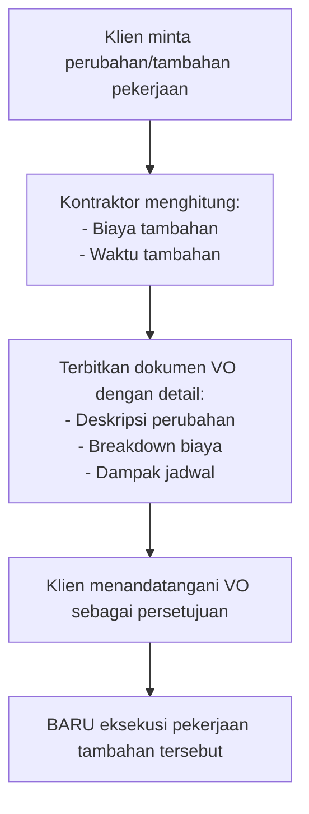

# BAB 4: PERTAHANAN ARUS KAS (CASH FLOW DEFENSE)

> *"Dalam bisnis konstruksi, cashflow adalah darah. Proyek bisa tetap rugi tapi berjalan jika kas tersedia, namun proyek akan langsung mati jika kas berhenti—terlepas dari seberapa besar 'potensi untung' di atas kertas."*

---

## Pendahuluan: Mimpi Buruk yang Nyata

Inilah skenario yang menjadi mimpi buruk setiap kontraktor:

> Proyek Anda sudah berjalan 60%. Klien sudah puas dengan progres. Secara hitungan, Anda akan untung Rp 50 juta di akhir proyek. Tapi ada satu masalah kecil: **Anda kehabisan uang tunai di minggu ke-6.**
>
> Termin berikutnya baru cair 2 minggu lagi. Material untuk minggu depan belum dibayar. Tukang menagih upah yang sudah telat 3 hari. Supplier menelepon meminta pelunasan hutang bulan lalu.
>
> Anda terpaksa menggunakan uang tabungan pribadi. Atau lebih buruk—mengambil pinjaman online dengan bunga mencekik. Proyek "untung" Anda berubah menjadi beban finansial yang meremukkan.

**Mengapa ini terjadi?**

Karena ada perbedaan fundamental antara **PROFIT** dan **CASH FLOW**.

- **Profit** adalah selisih antara pendapatan dan biaya secara akuntansi
- **Cash Flow** adalah aliran UANG TUNAI masuk dan keluar dari rekening

Anda bisa profit di atas kertas, tapi bangkrut karena kehabisan kas.

Bab ini akan mengajarkan Anda strategi **Cash Flow Defense**—bagaimana melindungi likuiditas bisnis Anda agar tidak pernah "kehabisan napas" di tengah proyek.

---

## 4.1 Prinsip "No Money, No Mix"

### Definisi Tegas Posisi Anda

Hal pertama yang harus Anda tanamkan dalam mindset bisnis:

> **Anda adalah KONTRAKTOR, bukan BANK bagi klien.**

Terlalu banyak kontraktor pemula yang "gak enak" meminta pembayaran tepat waktu. Mereka mulai pekerjaan meskipun DP belum masuk. Mereka melanjutkan meskipun termin terlambat. Mereka menggunakan uang sendiri untuk "talangan sementara".

**Hasil akhirnya?** Mereka yang menanggung beban finansial sementara klien santai menikmati bangunan yang sedang naik.

### Aturan "No Money, No Mix" yang Tidak Boleh Dilanggar

1. **JANGAN memulai pekerjaan sebelum DP masuk ke rekening**
   - Bukan "transfer pending"
   - Bukan "gocek sudah, besok masuk"
   - Bukan janji verbal
   - Harus sudah MASUK dan bisa ditarik

2. **JANGAN melanjutkan ke tahap berikutnya sebelum termin cair**
   - Struktur selesai? Stop. Tunggu termin sebelum lanjut ke dinding.
   - Klien minta "lanjut dulu nanti dibayar"? Jawab dengan sopan: "Mohon maaf, SOP kami mengharuskan pembayaran termin sebelum melanjutkan ke tahap berikutnya."

3. **JANGAN menggunakan uang pribadi untuk talangan proyek**
   - Jika cash flow proyek tidak sehat, itu bukan tanggung jawab dompet pribadi Anda
   - Jika terpaksa talangan, catat sebagai HUTANG proyek ke Anda (dengan bunga atau bagi hasil!)

### Cara Menyampaikan Aturan Ini ke Klien

Jangan menunggu sampai terjadi masalah. Komunikasikan aturan ini SEJAK AWAL, di kontrak dan penjelasan lisan:

> **Script untuk Penjelasan Awal:**
> 
> "Pak/Bu, agar proyek berjalan lancar, kami menerapkan sistem pembayaran berbasis milestone. Artinya, setiap tahap pekerjaan akan dilanjutkan setelah pembayaran tahap sebelumnya diterima. Sistem ini bukan karena ketidakpercayaan, melainkan untuk menjaga cash flow proyek agar tidak ada hambatan pembayaran material atau upah yang bisa mengganggu kualitas kerja."

---

## 4.2 Manajemen Budget Mingguan: Taktik Tempur Harian

### Mengapa RAB Saja Tidak Cukup?

RAB adalah peta strategis jangka panjang—menunjukkan total biaya dari awal sampai akhir proyek. Tapi dalam eksekusi harian, Anda butuh **taktik tempur mingguan** yang lebih presisi.

Bayangkan RAB seperti peta Indonesia. Berguna untuk navigasi besar, tapi tidak cukup detail untuk menunjukkan kemacetan di jalan Sudirman pagi ini. Untuk itu Anda butuh Google Maps real-time.

**Budget Mingguan = Google Maps untuk cash flow Anda.**

### Struktur Budget Mingguan

Untuk setiap minggu proyek, buat breakdown:

| Komponen | Detail | Perkiraan Rp |
|----------|--------|--------------|
| **Upah Tukang & Mandor** | Jumlah orang x tarif harian x hari kerja | Rp XXX |
| **Material Minggu Ini** | Sesuai tahap pekerjaan | Rp XXX |
| **Operasional** | Bensin, makan, koordinasi | Rp XXX |
| **Kontinjensi** | 5-10% dari total mingguan | Rp XXX |
| **TOTAL KEBUTUHAN MINGGU INI** | | Rp XXX |

### Contoh Tabel Budget Mingguan

**Proyek:** Renovasi Rumah Rp 150 Juta  
**Durasi:** 6 Minggu

| Minggu | Tahap Pekerjaan | Upah | Material | Operasional | Total |
|--------|-----------------|------|----------|-------------|-------|
| 1 | Bongkaran & Struktur | 4.5 jt | 7.0 jt | 0.5 jt | **12.0 jt** |
| 2 | Struktur & Dinding | 4.5 jt | 6.0 jt | 0.4 jt | **10.9 jt** |
| 3 | Dinding & Plesteran | 4.5 jt | 8.0 jt | 0.6 jt | **13.1 jt** |
| 4 | Atap & Plafon | 4.5 jt | 9.0 jt | 0.7 jt | **14.2 jt** |
| 5 | Lantai & MEP | 4.5 jt | 10.0 jt | 0.6 jt | **15.1 jt** |
| 6 | Finishing | 4.5 jt | 8.0 jt | 0.6 jt | **13.1 jt** |
| **TOTAL** | | **27.0 jt** | **48.0 jt** | **3.4 jt** | **78.4 jt** |

### Sistem "Planned vs Actual"

SETIAP akhir minggu, bandingkan **RENCANA** dengan **KENYATAAN**:

| Item | Budget (Planned) | Aktual (Actual) | Varian | Status |
|------|------------------|-----------------|--------|--------|
| Upah Minggu 3 | 4.5 jt | 4.8 jt | +300 rb | Over |
| Material Minggu 3 | 8.0 jt | 7.2 jt | -800 rb | Under |
| Operasional Minggu 3 | 0.6 jt | 0.9 jt | +300 rb | Over |
| **Total Minggu 3** | **13.1 jt** | **12.9 jt** | **-200 rb** | OK |

**Aturan Alarm:**
- Jika varian > 10% dari budget mingguan → **INVESTIGASI SEGERA**
- Jika akumulasi varian > 5% dari total RAB → **AUDIT MENYELURUH**

---

## 4.3 The Invisible Cost: Bahaya Laten Overhead

### Apa Itu Overhead?

Overhead adalah biaya-biaya yang TETAP BERJALAN terlepas dari ada tidaknya proyek:

| Kategori | Contoh | Perkiraan Bulanan |
|----------|--------|-------------------|
| **Kantor** | Sewa, listrik, internet | Rp 2-5 juta |
| **Karyawan Tetap** | Admin, marketing | Rp 3-8 juta |
| **Transportasi** | Motor/mobil operasional | Rp 1-2 juta |
| **Teknologi** | Software, cloud storage | Rp 200-500 ribu |
| **Legalitas** | Izin usaha, asuransi | Rp 100-500 ribu |

### Bahaya Overhead yang Tidak Tercover

Bayangkan skenario ini:

> Anda handle 3 proyek bulan ini, masing-masing profit Rp 10 juta = Total Rp 30 juta.
>
> Tapi overhead bulanan Anda:
> - Sewa kantor: Rp 5 juta
> - Gaji admin: Rp 4 juta  
> - Operasional: Rp 3 juta
> - Gaji Anda sebagai owner: Rp 10 juta
> - Total: Rp 22 juta
>
> Profit bersih sebenarnya: Rp 30 juta - Rp 22 juta = **Rp 8 juta**
>
> Itu masih OK. Tapi bagaimana kalau bulan depan hanya ada 1 proyek? Profit Rp 10 juta vs overhead Rp 22 juta = **RUGI Rp 12 juta.**

### Gaji Owner: Realita yang Harus Dihadapi

Ini adalah kebenaran yang tidak nyaman:

> **Gaji Anda sebagai owner adalah BIAYA TETAP, bukan profit.**

Banyak kontraktor berpikir: "Profit proyek ini Rp 20 juta." Padahal jika mereka bekerja 2 bulan penuh untuk proyek itu dan tidak menghitung gaji diri sendiri, mereka sebenarnya sedang bekerja gratis.

**Formula yang Benar:**

$$
Profit_{Perusahaan} = Nilai_{Kontrak} - HPP - Overhead_{ProRata} - Gaji_{OwnerProRata}
$$

**Contoh Kalkulasi:**

```
Proyek A (durasi 2 bulan):
- Nilai Kontrak: Rp 200 juta
- HPP: Rp 150 juta
- Overhead 2 bulan: Rp 12 juta (Rp 6 juta x 2)
- Gaji Owner 2 bulan: Rp 20 juta (Rp 10 juta x 2)

Profit Sebenarnya = 200 - 150 - 12 - 20 = Rp 18 juta

Margin Sebenarnya = 18/200 = 9% ← SANGAT TIPIS!
```

### Strategi Mengcover Overhead

1. **Alokasikan porsi overhead ke setiap proyek**
   - Hitung total overhead bulanan
   - Bagi ke jumlah proyek yang berjalan bulan itu
   - Masukkan ke struktur HPP setiap proyek

2. **Jaga minimum project value**
   - Hitung: berapa minimum nilai proyek per bulan untuk cover overhead?
   - Jangan ambil proyek di bawah threshold tersebut

3. **Lean overhead**
   - Kantor? Kerja dari rumah sampai profit stabil
   - Karyawan? Gunakan freelance per-proyek
   - Kendaraan? Sewa saat butuh, bukan beli

---

## 4.4 Budget Darurat & Dana Kontinjensi

### Dana Buffer: Safety Net untuk Ketidakpastian

Industri konstruksi penuh dengan variabel yang tidak bisa diprediksi:

| Risiko | Dampak Finansial | Frekuensi |
|--------|------------------|-----------|
| Hujan berkepanjangan | Stop kerja, upah tetap jalan | Tinggi |
| Harga material naik | Margin tergerus | Tinggi |
| Material rusak/salah | Beli ulang | Sedang |
| Rework karena kesalahan | Double cost | Sedang |
| Tukang sakit/berhenti | Cari pengganti, delay | Sedang |
| Klien terlambat bayar | Cash flow tersendat | Tinggi |

**Solusi: Siapkan Dana Buffer 5-10% dari HPP**

```
HPP Proyek: Rp 150 juta
Dana Buffer (7.5%): Rp 11.25 juta ≈ Rp 12 juta

Dana ini dialokasikan untuk:
- Kenaikan harga material tak terduga
- Cuaca buruk yang memperpanjang durasi
- Rework minor
- Koordinasi tambahan
```

**Cara Menyembunyikan Buffer dari Klien:**

Jangan tampilkan buffer sebagai item terpisah dalam penawaran. Klien yang melihat "Kontinjensi 10%" akan bertanya "Buat apa?" dan meminta dihapus.

Masukkan buffer ke dalam item:
- "Biaya Manajemen Proyek" (besar sedikit tidak masalah)
- Dibagi rata ke setiap item pekerjaan (+5-10%)

### Simulasi Penggunaan Buffer

**Skenario: Proyek Renovasi Rp 100 Juta**

```
Timeline Awal: 6 minggu
Buffer: Rp 7.5 juta

MINGGU 3: Hujan deras 4 hari berturut-turut
- Kerja terhenti total 3 hari
- Upah tukang tetap jalan: Rp 1.5 juta (dari buffer)
- Sisa buffer: Rp 6 juta

MINGGU 4: Harga semen naik 15%
- Selisih harga dari budget: Rp 800 ribu (dari buffer)
- Sisa buffer: Rp 5.2 juta

MINGGU 5: Ditemukan pipa bocor yang perlu diganti (di luar scope)
- Ini bukan tanggung jawab kontraktor → terbitkan VO ke klien
- Buffer tidak terpakai

MINGGU 6: Proyek selesai
- Sisa buffer: Rp 5.2 juta → Bonus profit!
```

---

## 4.5 Variabel Order (VO): Perisai Pertahanan Margin

### Mengapa VO Sangat Penting?

Variation Order adalah dokumen formal yang mencatat SETIAP perubahan atau tambahan pekerjaan di luar scope kontrak awal.

Tanpa VO, Anda akan:
- Mengerjakan pekerjaan tambahan tanpa kompensasi
- Terlibat sengketa "katanya-katanya" dengan klien
- Kehilangan margin karena scope creep

**Prinsip Dasar:**
> Anda bukan YAYASAN AMAL. Setiap perubahan atau tambahan pekerjaan harus diikuti dengan penyesuaian biaya dan waktu.

### Kapan Menerbitkan VO?

Terbitkan VO SEBELUM mengerjakan pekerjaan tambahan, dalam situasi:

| Situasi | Contoh | Tindakan |
|---------|--------|----------|
| **Tambahan Pekerjaan** | "Sekalian pasang canopy depan, ya" | VO untuk biaya + waktu tambahan |
| **Perubahan Spesifikasi** | "Ganti granit ke marmer import" | VO untuk selisih harga |
| **Perubahan Desain** | "Dindingnya geser 50cm ke kanan" | VO untuk bongkar + pasang ulang |
| **Kondisi Tak Terduga** | "Ternyata ada tanah keras di bawah" | VO untuk galian ekstra |
| **Permintaan Tambahan** | "Tambah 2 titik lampu" | VO untuk material + jasa |

### Workflow Penerbitan VO



### Template Variation Order

> **VARIATION ORDER**
> **[Logo Perusahaan]**
>
> **Nomor VO**    : VO/[XXX]/[Kode Proyek]/2024
> **Tanggal**     : [dd/mm/yyyy]
> **Proyek**      : [Nama Proyek]
> **Lokasi**      : [Alamat]
> **Klien**       : [Nama Klien]
>
> ---
>
> **REFERENSI KONTRAK AWAL**
> Nomor Kontrak : [XXX]
> Nilai Kontrak : Rp [XXX.XXX.XXX]
> Durasi Kontrak: [XX] hari kerja
>
> ---
>
> **DESKRIPSI VARIASI**
>
> Jenis Variasi:
> - [ ] Tambahan Pekerjaan
> - [ ] Perubahan Spesifikasi
> - [ ] Perubahan Desain
> - [ ] Kondisi Tak Terduga
>
> Detail Perubahan:
> ________________________________________________________________
> ________________________________________________________________
> ________________________________________________________________
>
> ---
>
> **RINCIAN BIAYA VARIASI**
>
> | No | Uraian | Jumlah (Rp) |
> |---|---|---|
> | 1 | [Detail item 1] | XXX.XXX |
> | 2 | [Detail item 2] | XXX.XXX |
> | 3 | [Detail item 3] | XXX.XXX |
> | | **TOTAL BIAYA VARIASI** | **Rp XXX.XXX.XXX** |
>
> ---
>
> **DAMPAK TERHADAP JADWAL**
> Perpanjangan waktu: [XX] hari kerja
> Jadwal penyelesaian baru: [dd/mm/yyyy]
>
> ---
>
> **PERSETUJUAN**
>
> | PIHAK KONTRAKTOR | PIHAK KLIEN |
> |---|---|
> | _____________________ | _____________________ |
> | Nama: | Nama: |
> | Jabatan: | Jabatan: |
> | Tanggal: | Tanggal: |

---

## 4.6 Audit Real-Time: Deteksi Dini Kebocoran

### Mengapa Audit Mingguan Kritis?

Banyak kontraktor baru menyadari proyeknya rugi SETELAH selesai. Pada titik itu, sudah terlambat untuk memperbaiki.

**Audit mingguan = CT Scan untuk kesehatan finansial proyek.**

Tujuannya: mendeteksi "penyakit" sedini mungkin sehingga bisa "diobati" sebelum menjadi fatal.

### Komponen Audit Mingguan

**1. Rekonsiliasi Kas**
```
Saldo awal minggu    : Rp XXX.XXX.XXX
(+) Pemasukan minggu : Rp XXX.XXX.XXX
(-) Pengeluaran minggu: Rp XXX.XXX.XXX
(=) Saldo akhir minggu: Rp XXX.XXX.XXX

Selisih dengan saldo bank: Rp ________ ← Harus Rp 0
```

**2. Progres vs Pengeluaran**

| Metrik | Nilai | Status |
|--------|-------|--------|
| Progres fisik | 45% | - |
| Pengeluaran vs RAB | 42% | Proporsional |
| Alarm | - | Normal |

**Formula Alarm:**
$$
\text{Jika } (\% \text{Pengeluaran}) > (\% \text{Progres Fisik}) + 10\%
$$
$$
\rightarrow \text{ALARM MERAH: Investigasi kemungkinan:}
$$
- Material waste tinggi
- Pencurian material
- Efisiensi tim rendah
- RAB underestimate

**3. Material Stock Check**
| Material | Masuk | Terpakai | Sisa | Kesesuaian |
|---|---|---|---|---|
| Semen | 100 zak | 75 zak | 25 zak | Sesuai |
| Pasir | 5 m³ | 4 m³ | 0.8 m³ | Kurang 0.2 |
| Besi 10mm | 20 btng | 18 btng | 2 btng | Sesuai |
| Keramik | 50 dus | 45 dus | 6 dus | Lebih 1 |

*Catatan: Investigasi selisih pasir 0.2 m³ - kemungkinan waste berlebih*

### Template Checklist Audit Mingguan

> **AUDIT MINGGUAN**
> **PROYEK:** _________________ **MINGGU KE:** ___
>
> - [ ] Rekonsiliasi saldo kas dengan rekening bank
> - [ ] Bandingkan pengeluaran aktual vs budget mingguan
> - [ ] Cek rasio progres fisik vs pengeluaran
> - [ ] Stock opname material di lapangan
> - [ ] Review nota/kuitansi minggu ini (ada yang mencurigakan?)
> - [ ] Cek termin pembayaran klien (on time atau terlambat?)
> - [ ] Update proyeksi cash flow minggu depan
> - [ ] Catat temuan & tindaklanjut
>
> **TEMUAN MINGGU INI:**
> _________________________________________________
> _________________________________________________
>
> **TINDAK LANJUT:**
> _________________________________________________
> _________________________________________________
>
> **Auditor:** _________________ **Tanggal:** _______________

---

## Ringkasan Bab 4

1. **"No Money, No Mix"** — Jangan pernah mulai atau lanjutkan pekerjaan tanpa dana masuk. Anda bukan bank bagi klien.

2. **Budget mingguan** adalah taktik tempur harian. RAB saja tidak cukup—Anda butuh detail pengeluaran per minggu.

3. **Sistem Planned vs Actual** mendeteksi deviasi sedini mungkin. Alarm berbunyi jika varian > 10%.

4. **Overhead membunuh profit diam-diam**. Gaji owner adalah BIAYA, bukan profit. Hitung dengan realistis.

5. **Dana buffer 5-10%** untuk antisipasi ketidakpastian. Sembunyikan dalam item biaya manajemen.

6. **Variation Order WAJIB** untuk setiap perubahan atau tambahan di luar scope. Bukan yayasan amal!

7. **Audit mingguan** = CT Scan finansial. Rekonsiliasi kas, cek progres vs pengeluaran, stock opname.

---

## Action Items Bab 4

Sebelum melanjutkan ke bab berikutnya, pastikan Anda sudah melakukan:

1. **Buat Script "No Money, No Mix"**
   - Tulis kalimat yang akan Anda sampaikan ke klien tentang sistem pembayaran
   - Latih menyampaikannya dengan percaya diri

2. **Buat Template Budget Mingguan**
   - Download/buat spreadsheet budget mingguan
   - Isi dengan proyeksi untuk proyek yang sedang berjalan
   - Mulai tracking Planned vs Actual

3. **Hitung Overhead Bulanan**
   - List semua biaya tetap bulanan (termasuk gaji Anda!)
   - Hitung: berapa minimum value proyek per bulan untuk survive?

4. **Siapkan Template VO**
   - Sesuaikan template VO dengan branding perusahaan
   - Cetak beberapa lembar untuk standby di lapangan

5. **Jadwalkan Audit Mingguan**
   - Pilih hari (Jumat sore atau Sabtu pagi recommended)
   - Block 1-2 jam di kalender
   - Gunakan checklist audit yang sudah disiapkan

---

*Sempurna! Anda sudah menguasai pertahanan arus kas yang anti-bocor. Di bab selanjutnya, kita akan masuk ke medan tempur sesungguhnya: SISTEM OPERASIONAL & TIM—bagaimana membangun mesin bisnis yang bisa berjalan tanpa Anda harus hadir setiap detik di lapangan.*

---
