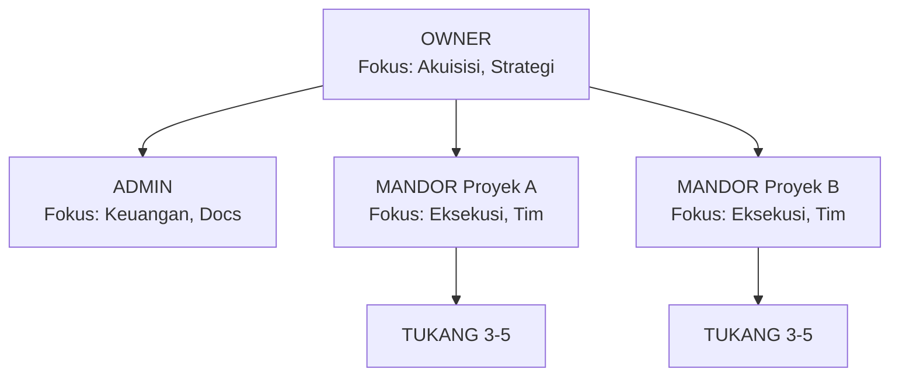
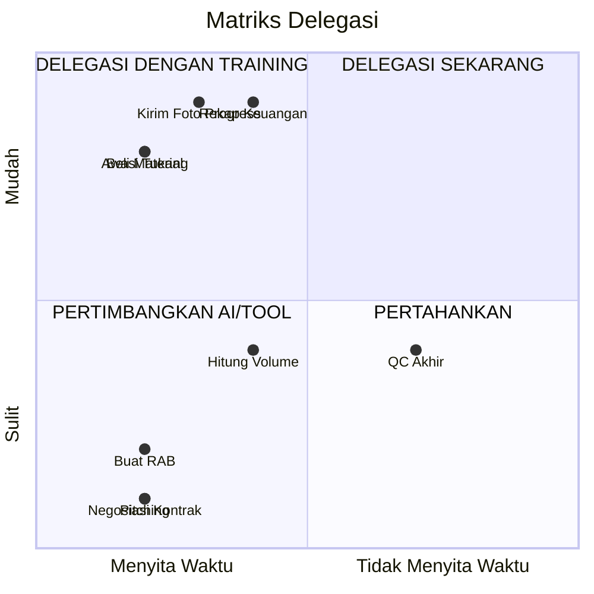

# BAB 5: SISTEM OPERASIONAL & TIM — MEMBANGUN MESIN BISNIS

> *"Bisnis yang hebat bukan yang berjalan saat owner hadir, melainkan yang tetap berjalan saat owner tidak ada. Mesin tidak butuh kehadiran Anda—mesin butuh SISTEM."*

---

## Pendahuluan: Jebakan "Tangan Sendiri"

Banyak kontraktor bangga dengan kemampuan mereka mengerjakan semuanya sendiri:

- "Saya sendiri yang survei lokasi"
- "Saya sendiri yang pilih material"
- "Saya sendiri yang awasi tukang"
- "Saya sendiri yang komunikasi dengan klien"
- "Saya sendiri yang handle keuangan"

Dari luar, ini terlihat seperti dedikasi tinggi dan kontrol penuh. Dari dalam, ini adalah **resep kebangkrutan untuk pertumbuhan**.

**Mengapa?**

Karena bisnis dengan model ini tidak bisa di-scale. Anda adalah *bottleneck*—titik kemacetan di mana semua keputusan harus melewati Anda. Hasilnya:
- Anda tidak bisa liburan (proyek terancam stop)
- Anda tidak bisa sakit (semua kacau)
- Anda tidak bisa handle lebih dari 1-2 proyek paralel
- Anda tidak punya waktu untuk aktivitas bernilai tinggi: akuisisi klien baru

Bab ini akan mengajarkan Anda cara membangun **SISTEM OPERASIONAL** yang berjalan tanpa kehadiran fisik Anda setiap detik—sehingga Anda bisa scaling dari 1 proyek menjadi 3-5 proyek paralel.

---

## 5.1 Arsitektur Tim Mini yang Efektif

### Struktur "Lean Team" untuk Kontraktor

Anda tidak butuh tim besar dan kompleks. Yang Anda butuhkan adalah tim LEAN dengan pembagian peran yang jelas:



### Definisi Peran & Tanggung Jawab

**1. OWNER (Anda)**

| Tugas Utama | Detail |
|-------------|--------|
| Akuisisi klien | Pitching, negosiasi, closing kontrak |
| Relationship management | Komunikasi high-level dengan klien VIP |
| Keputusan strategis | Ambil/tolak proyek, harga penawaran |
| Pengembangan bisnis | Branding, networking, scaling |
| Quality oversight | Inspeksi akhir proyek-proyek penting |

**Yang TIDAK boleh dikerjakan owner:**
- Mengawasi tukang harian (ini tugas mandor)
- Membeli material ke toko (ini bisa didelegasikan)
- Chat dan call klien untuk hal sepele (ini tugas admin)
- Menghitung jumlah besi atau semen (ini tugas mandor/estimator)

**2. ADMIN/KOORDINATOR KANTOR**

| Tugas Utama | Detail |
|-------------|--------|
| Manajemen keuangan | Invoice, payment, rekap pengeluaran |
| Dokumentasi | Kontrak, VO, berita acara |
| Komunikasi rutin | WA klien untuk info non-teknis |
| Reporting | Laporan mingguan ke owner |
| Procurement | Koordinasi order material |

**Skill yang dibutuhkan:**
- Teliti dan terorganisir
- Familiar dengan Excel/Spreadsheet
- Komunikasi tertulis baik
- Bisa dipercaya untuk handle uang

**Bisa mulai dari:** Part-time remote, 3-4 jam/hari

**3. MANDOR**

| Tugas Utama | Detail |
|-------------|--------|
| Eksekusi lapangan | Memimpin pekerjaan harian tukang |
| Koordinasi tim | Briefing pagi, pembagian tugas |
| Quality Control | Cek hasil kerja sebelum lanjut |
| Problem solving | Tangani masalah teknis di lapangan |
| Reporting | Laporan harian ke owner/admin |

**Kriteria mandor ideal:**
- Pengalaman minimal 3-5 tahun sebagai tukang senior
- Bisa baca gambar kerja
- Kemampuan leadership dasar
- Jujur dan bisa dipercaya (ini YANG TERPENTING)
- Punya HP dan bisa kirim foto/WA

**4. TUKANG**

| Tugas Utama | Detail |
|-------------|--------|
| Eksekusi teknis | Mengerjakan pekerjaan fisik konstruksi |
| Spesialisasi | Tukang batu, tukang kayu, tukang besi, dll |
| Kebersihan | Menjaga area kerja bersih |
| Reporting | Lapor ke mandor jika ada masalah |

**Sistem kerja tukang:**
- Bisa harian (Rp 150.000 - 300.000/hari)
- Bisa borongan (per m², per item)
- Sistem borongan = risiko ke tukang, motivasi lebih tinggi

---

## 5.2 Matriks Delegasi: Apa yang Bisa Anda Lepas?

### The 4 Quadrants of Delegation



### Contoh Matriks Delegasi untuk Kontraktor

| Aktivitas | Waktu | Kesulitan | Aksi |
|-----------|-------|-----------|------|
| Awasi tukang harian | Tinggi | Rendah | 🟢 Delegasi ke Mandor |
| Beli material | Tinggi | Rendah | 🟢 Delegasi ke Mandor/Admin |
| Kirim foto progress ke klien | Sedang | Rendah | 🟢 Delegasi ke Admin |
| Hitung volume pekerjaan | Tinggi | Sedang | 🟡 Training Mandor + Verifikasi |
| Buat RAB | Tinggi | Tinggi | 🔴 Anda (bisa dibantu admin) |
| Negosiasi kontrak | Tinggi | Tinggi | 🔴 Anda |
| Pitching ke klien baru | Tinggi | Tinggi | 🔴 Anda |
| Rekap keuangan | Sedang | Rendah | 🟢 Delegasi ke Admin |
| QC akhir proyek | Rendah | Sedang | 🟡 Anda + Mandor |

### Sistem "3 Level Decision"

Untuk menghindari semua keputusan menumpuk ke Anda, terapkan sistem level keputusan:

| Level | Pembuat Keputusan | Contoh |
|-------|-------------------|--------|
| **Level 1** | Mandor | Pembagian tugas harian, urutan pengerjaan, pemilihan tukang yang hadir |
| **Level 2** | Admin | Jadwal pengiriman material, koordinasi invoice, scheduling meeting klien |
| **Level 3** | Owner | Accept/reject klien baru, persetujuan VO besar, masalah eskalasi serius |

**Training Tim:**
> "Untuk keputusan Level 1, kamu boleh langsung putuskan tanpa tanya saya. Untuk Level 2, konsultasikan dengan Admin. Untuk Level 3, baru hubungi saya."

---

## 5.3 SOP Proyek: Dari Awal Sampai Serah Terima

### Mengapa SOP Penting?

**Tanpa SOP:**
- Setiap proyek ulang dari nol
- Kualitas tergantung "mood" tim hari itu
- Mudah ada yang terlupa
- Tidak bisa di-audit atau diperbaiki

**Dengan SOP:**
- Konsistensi kualitas
- Tim bisa handle tanpa owner
- Mudah training orang baru
- Jadi benchmark untuk improvement

### SOP Alur Proyek Konstruksi

**FASE 1: PRE-CONSTRUCTION (Sebelum Proyek Mulai)**

| Step | Penanggung Jawab | Output |
|------|------------------|--------|
| 1. Survei lokasi | Owner/Mandor | Foto existing, catatan kondisi |
| 2. Estimasi RAB | Owner/Estimator | Dokumen RAB draft |
| 3. Penawaran ke klien | Owner | SPH + follow up |
| 4. Negosiasi & closing | Owner | Kontrak ditandatangani |
| 5. Terima DP | Admin | Bukti transfer verified |
| 6. Kick-off meeting | Owner + Mandor | Timeline, pembagian tugas, aturan main |
| 7. Mobilisasi | Mandor | Alat & material awal siap di lokasi |

**Checklist Pre-Construction:**
```
□ Foto kondisi existing sudah diambil (before)
□ RAB final sudah approved klien
□ Kontrak ditandatangani kedua pihak
□ DP sudah masuk rekening
□ Timeline proyek sudah disepakati
□ Kick-off meeting sudah dilakukan
□ Mandor sudah brief dengan detail scope
□ Material awal sudah dipesan/ready
□ Alat kerja sudah di-check
□ Nomor emergency klien tercatat
```

**FASE 2: CONSTRUCTION (Eksekusi Proyek)**

| Aktivitas | Frekuensi | Penanggung Jawab |
|-----------|-----------|------------------|
| Briefing pagi | Daily | Mandor |
| Eksekusi pekerjaan | Daily | Tukang |
| QC pekerjaan harian | Daily | Mandor |
| Foto progress | Daily | Mandor |
| Kirim laporan ke klien | 2-3x/minggu | Admin |
| Rekap pengeluaran | Weekly | Admin |
| Audit progres vs budget | Weekly | Owner |
| Site visit owner | 2-3x per proyek | Owner |

**Ritual Briefing Pagi (5-10 menit):**
1. Review target kemarin (tercapai atau tidak)
2. Target pekerjaan hari ini
3. Potensi masalah yang harus diantisipasi
4. Kebutuhan material/alat hari ini
5. Pembagian tugas tim

**FASE 3: HANDOVER (Serah Terima)**

| Step | Penanggung Jawab | Output |
|------|------------------|--------|
| 1. Finishing check | Mandor | Punchlist (daftar touch-up) |
| 2. Perbaikan punchlist | Tukang | Semua item selesai |
| 3. Cleaning total | Tukang/Cleaning | Lokasi bersih |
| 4. Walk-through dengan klien | Owner/Mandor | Persetujuan klien |
| 5. Foto after | Mandor | Dokumentasi lengkap |
| 6. Berita Acara Serah Terima | Admin | Dokumen ditandatangani |
| 7. Invoice retensi | Admin | Invoice terkirim |
| 8. Minta testimoni | Owner | Review Google/WA |

**Template Berita Acara Serah Terima:**
```
BERITA ACARA SERAH TERIMA PEKERJAAN
────────────────────────────────────

Pada hari ini, [hari], tanggal [tanggal],
bertempat di [lokasi proyek],

PIHAK PERTAMA (Kontraktor):
Nama    : [Nama Kontraktor]
Alamat  : [Alamat]

PIHAK KEDUA (Pemberi Kerja):
Nama    : [Nama Klien]
Alamat  : [Alamat]

Telah dilakukan serah terima pekerjaan:
[Deskripsi singkat proyek]

Dengan kondisi sebagai berikut:
□ Semua pekerjaan sesuai kontrak telah selesai
□ Pekerjaan telah diperiksa dan diterima baik
□ Masa pemeliharaan: [X] bulan sejak tanggal ini
□ Retensi [X]% akan dicairkan setelah masa pemeliharaan

Catatan/Punch List:
_________________________________________________
_________________________________________________

Demikian berita acara ini dibuat untuk digunakan sebagaimana mestinya.

          PIHAK PERTAMA                   PIHAK KEDUA

     ____________________           ____________________
```

---

## 5.4 Quality Control: Checklist Anti Cacat

### Filosofi QC: "Prevent, Don't React"

> Lebih murah mencegah kesalahan daripada memperbaikinya.

Biaya rework (bongkar-pasang ulang) bisa mencapai **3-5x lipat** dari biaya mengerjakan dengan benar sejak awal.

### Checklist QC per Tahap Pekerjaan

**A. QC PEKERJAAN PONDASI**

| Item Check | Standar | ✓ |
|------------|---------|---|
| Kedalaman galian | Sesuai gambar ± 5cm | □ |
| Dimensi sloof | Sesuai gambar ± 1cm | □ |
| Diameter besi | Sesuai spek (10mm/12mm) | □ |
| Jarak sengkang | Sesuai gambar ± 1cm | □ |
| Selimut beton | Min. 3cm | □ |
| Slump test beton | 10-12 cm | □ |
| Curing beton | Min. 7 hari basah | □ |

**B. QC PEKERJAAN DINDING**

| Item Check | Standar | ✓ |
|------------|---------|---|
| Vertikal dinding | Lot air/waterpass | □ |
| Horizontal dinding | Benang + lot | □ |
| Ketebalan spesi | 1-1.5 cm konsisten | □ |
| Campuran spesi | 1:4 (semen:pasir) | □ |
| Lubang untuk MEP | Sudah disiapkan | □ |
| Hubungan kolom-dinding | Angkur terpasang | □ |

**C. QC PEKERJAAN PLESTERAN**

| Item Check | Standar | ✓ |
|------------|---------|---|
| Ketebalan plester | 1.5-2 cm merata | □ |
| Kerataan permukaan | Test dengan jidar 2m | □ |
| Sudut dinding | 90° (cek dengan siku) | □ |
| Tidak ada retak | Visual check | □ |
| Curing plester | Siram 3 hari | □ |

**D. QC PEKERJAAN KERAMIK**

| Item Check | Standar | ✓ |
|------------|---------|---|
| Kemiringan lantai | Ke arah floor drain | □ |
| Tidak ada kopong | Tes ketuk | □ |
| Nat rapi | Lebar konsisten | □ |
| Cutting halus | Tidak gompal di pinggir | □ |
| Level antar keramik | Rata, tidak benjol | □ |
| Pola sesuai | Match dengan desain | □ |

### Dashboard Digital untuk Monitoring

Gunakan tools sederhana untuk monitoring multi-proyek:

**Rekomendasi Tools (Gratis/Murah):**

| Tools | Fungsi | Harga |
|-------|--------|-------|
| **Google Sheets** | Tracking budget, timeline | Gratis |
| **WhatsApp Group** | Komunikasi tim | Gratis |
| **Google Drive** | Storage foto progress | Gratis |
| **Notion** | Project management | Gratis (basic) |
| **Trello** | Kanban board task | Gratis (basic) |

**Struktur Google Sheets untuk Multi-Proyek:**

```
SHEET 1: MASTER DASHBOARD
──────────────────────────────────────────────────────────────
Proyek A │ Progress 65% │ Budget vs Actual: OK │ Issue: None
Proyek B │ Progress 30% │ Budget vs Actual: +5% │ Issue: Weather
Proyek C │ Progress 90% │ Budget vs Actual: OK │ Issue: Punchlist

SHEET 2: PROYEK A - DETAIL
──────────────────────────────────────────────────────────────
Minggu │ Target │ Actual │ Budget │ Spent │ Variance

SHEET 3: PROYEK B - DETAIL
(sama)

SHEET 4: DATABASE MANDOR & TUKANG
──────────────────────────────────────────────────────────────
Nama │ Skill │ Rating │ HP │ Notes
```

---

## 5.5 Manajemen Tim: HR System Sederhana

### Masalah Klasik dengan Tukang

1. **Tidak konsisten hadir** — Muncul kalau mau saja
2. **Kabur di tengah proyek** — Dapat tawaran lain yang lebih menarik
3. **Kualitas berfluktuasi** — Bagus di awal, jelek belakangan
4. **Tidak jujur** — Material "lenyap", jam kerja dibodong-in
5. **Tidak loyal** — Pindah ke kompetitor tanpa notice

### Sistem "Poin & Prioritas"

Buat sistem sederhana untuk evaluasi dan insentif:

**Poin Positif (+):**
| Achievement | Poin |
|-------------|------|
| Hadir tepat waktu | +1 |
| Selesaikan target harian | +2 |
| Quality check lulus | +3 |
| Inisiatif solve masalah | +2 |
| Proyek selesai tanpa komplain | +5 |

**Poin Negatif (-):**
| Pelanggaran | Poin |
|-------------|------|
| Telat tanpa kabar | -2 |
| Tidak hadir tanpa izin | -5 |
| QC gagal (rework) | -3 |
| Keluhan dari klien | -5 |
| Material waste/hilang | -5 |

**Konsekuensi Akumulasi:**
- **Poin tinggi (>20):** Prioritas pertama untuk proyek bagus, bonus akhir tahun
- **Poin sedang (10-20):** Normal, panggil kalau perlu
- **Poin rendah (<10):** Review serius, pertimbangkan tidak panggil lagi
- **Poin negatif (<0):** Blacklist

### Kontrak Sederhana dengan Freelancer

Meskipun tukang berstatus freelancer, **WAJIB** ada perjanjian tertulis sederhana:

> **SURAT KESEPAKATAN KERJA PROYEK**
>
> **Yang bertandatangan di bawah ini:**
> 1. [Nama Kontraktor] selaku Pemberi Kerja
> 2. [Nama Tukang/Mandor] selaku Pekerja
>
> **Bersepakat sebagai berikut:**
>
> **1. PROYEK**
> - Nama Proyek : ________________________
> - Lokasi      : ________________________
> - Durasi      : ____________ hari kerja
>
> **2. URAIAN PEKERJAAN**
> - ________________________________________
> - ________________________________________
>
> **3. SISTEM UPAH**
> - [ ] Harian  : Rp ____________/hari
> - [ ] Borongan: Rp ____________ (total)
> - Pembayaran  : [Mingguan/Per termin/Akhir proyek]
>
> **4. KETENTUAN**
> - Jam kerja: 08.00 - 17.00 (istirahat 1 jam)
> - Tidak hadir tanpa izin = potong upah
> - Kerusakan akibat kelalaian = tanggung jawab pekerja
> - Pekerja wajib ikuti arahan mandor/owner
>
> **5. FORCE MAJEURE**
> Pekerjaan dapat dihentikan jika terjadi bencana alam, pandemi, atau kondisi force majeure lainnya.
>
> **[Tempat], [Tanggal]**
>
> **PEMBERI KERJA** &nbsp;&nbsp;&nbsp;&nbsp;&nbsp;&nbsp;&nbsp;&nbsp;&nbsp;&nbsp;&nbsp;&nbsp;&nbsp;&nbsp;&nbsp;&nbsp;&nbsp;&nbsp;&nbsp;&nbsp;&nbsp;&nbsp;&nbsp;&nbsp;&nbsp;&nbsp;&nbsp;&nbsp;&nbsp;&nbsp; **PEKERJA**
>
> ____________________ &nbsp;&nbsp;&nbsp;&nbsp;&nbsp;&nbsp;&nbsp;&nbsp;&nbsp;&nbsp;&nbsp;&nbsp;&nbsp;&nbsp;&nbsp;&nbsp;&nbsp;&nbsp;&nbsp; ____________________

---

## Ringkasan Bab 5

1. **Tim lean > tim besar.** Struktur: Owner (strategi) → Admin (support) → Mandor (lapangan) → Tukang (eksekusi).

2. **Delegasi adalah kunci scaling.** Gunakan matriks delegasi—identifikasi tugas yang bisa dilepas dan training tim untuk handle.

3. **SOP membuat konsistensi.** Pre-construction → Construction → Handover—semua ada checklistnya.

4. **QC bukan opsional.** Checklist per tahap (pondasi, dinding, keramik) mencegah rework yang mahal.

5. **Dashboard digital** membantu monitoring multi-proyek: Google Sheets + WhatsApp Group sudah cukup powerful.

6. **Sistem poin & prioritas** untuk manage freelancer: reward yang bagus, "hukum" yang malas.

---

## Action Items Bab 5

Sebelum melanjutkan ke bab berikutnya, pastikan Anda sudah melakukan:

1. **Gambar Struktur Tim Ideal Anda**
   - Meskipun sekarang handle sendiri, gambar struktur yang Anda targetkan
   - Identifikasi: posisi mana yang harus diisi pertama?

2. **Buat Matriks Delegasi Personal**
   - List 20 aktivitas rutin Anda
   - Kategorikan berdasarkan waktu dan kesulitan
   - Identifikasi 3-5 yang bisa segera didelegasikan

3. **Draft SOP Proyek Anda**
   - Mulai dari SOP sederhana untuk 1 jenis proyek (misal: renovasi kamar mandi)
   - Include checklist pre-construction, daily routine, dan handover

4. **Buat Checklist QC**
   - Download atau buat checklist QC untuk 3 pekerjaan utama
   - Cetak dan simpan di lokasi proyek

5. **Setup Dashboard Tracking**
   - Buat Google Sheets sederhana untuk track proyek
   - Include: timeline, budget vs actual, issue tracker

6. **Draft Kontrak Freelancer**
   - Sesuaikan template dengan kebutuhan Anda
   - Gunakan untuk mandor/tukang di proyek berikutnya

---

*Luar biasa! Anda sudah memiliki blueprint untuk membangun mesin bisnis yang bisa berjalan tanpa Anda. Di bab terakhir, kita akan membahas level tertinggi: SKALABILITAS — bagaimana bertransformasi dari kontraktor menjadi developer, dan membangun imperium properti jangka panjang.*

---
