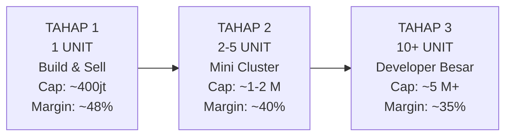
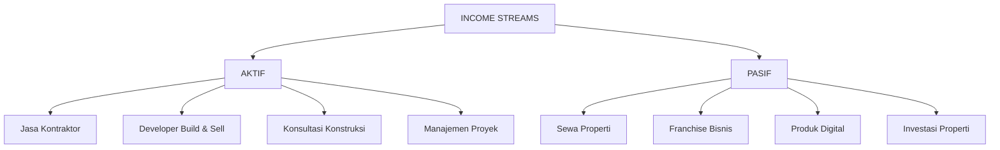
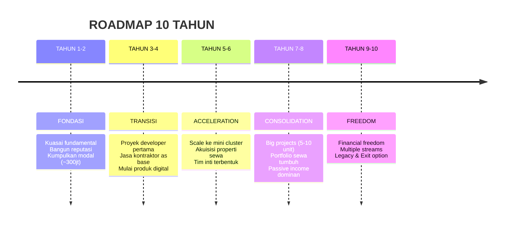

# BAB 6: SKALABILITAS — DARI KONTRAKTOR KE DEVELOPER

> *"Kontraktor membangun rumah orang lain. Developer membangun aset milik sendiri. Kontraktor menjual waktu. Developer menjual nilai."*

---

## Pendahuluan: The Ultimate Evolution

Jika Bab 1-5 mengajarkan Anda cara menjadi **kontraktor yang profitable**, Bab ini akan membawa Anda ke level berikutnya: **transformasi menjadi developer properti**.

Mengapa ini penting?

Karena sebagai kontraktor, Anda menghadapi ceiling (batas atas) alamiah:
- Pendapatan berbanding lurus dengan jumlah proyek dikerjakan
- Margin terbatas di kisaran 15-25%
- Cash flow selalu bergantung pada pembayaran klien
- Tidak ada aset yang tersisa setelah proyek selesai

Sebagai **developer**, paradigma berubah total:
- Anda memiliki ASET properti
- Margin bisa mencapai 30-50% dari modal
- Capital gain dari apresiasi tanah/bangunan
- Legacy yang bisa diwariskan

Bab ini adalah **peta perjalanan** dari fase kontraktor ke fase developer—dan seterusnya ke investor properti.

---

## 6.1 Model "Build & Sell": Pintu Masuk Developer

### Apa Itu Build & Sell?

Build & Sell adalah model bisnis di mana Anda:
1. **Membeli/mengakuisisi lahan** (atau Joint Venture dengan pemilik lahan)
2. **Membangun properti** di atas lahan tersebut
3. **Menjual properti yang sudah jadi** dengan capital gain

**Perbedaan dengan Kontraktor Biasa:**

| Aspek | Kontraktor | Developer (Build & Sell) |
|-------|------------|-------------------------|
| Kepemilikan tanah | Milik klien | Milik sendiri/JV |
| Kepemilikan bangunan | Milik klien | Milik sendiri sampai terjual |
| Source of profit | Margin jasa | Capital gain aset |
| Risk level | Rendah-sedang | Tinggi |
| Reward potential | 15-25% | 30-50%+ |
| Cashflow | Termin dari klien | Modal sendiri → Cash saat jual |

### Simulasi Proyek Build & Sell (1 Unit Rumah)

**Studi Kasus: Rumah Type 45/60 di Pinggiran Kota**

### Simulasi BIAYA (CAPITAL)

| Item | Nominal (Rp) |
|---|---|
| Akuisisi Tanah (60 m² x Rp 2.5 jt) | 150.000.000 |
| Biaya Legalitas Tanah | 10.000.000 |
| Biaya Konstruksi (45 m² x Rp 4 jt) | 180.000.000 |
| Biaya Infrastruktur & Landscape | 20.000.000 |
| Biaya Marketing & Sales | 15.000.000 |
| Biaya Legalitas IMB/PBG | 10.000.000 |
| Buffer & Contingency (5%) | 19.250.000 |
| **TOTAL CAPITAL** | **404.250.000** |

### Simulasi PROFIT

| Item | Nominal / % |
|---|---|
| Benchmark Pasar | Rp 550-650 juta |
| **Harga Jual Ditargetkan** | **Rp 600.000.000** |
| Gross Profit | Rp 195.750.000 |
| **Margin** | **48.4%** |
| Durasi Proyek (build + sell) | 8-12 bulan |
| ROI Annualized | ~50-70% |

### Risiko yang Harus Diantisipasi

| Risiko | Deskripsi | Mitigasi |
|--------|-----------|----------|
| **Lahan tidak laku** | Tidak ada pembeli | Riset lokasi matang, pricing competitive |
| **Cost overrun** | Biaya membengkak | RAB ketat + buffer 10% |
| **Legalitas bermasalah** | Sertifikat tidak clear | Due diligence sebelum beli |
| **Cashflow seret** | Modal habis sebelum jual | Funding plan dari awal |
| **Pasar lesu** | Daya beli turun | Mulai dari segmen affordable |

---

## 6.2 Akuisisi Lahan: Strategi Modal Minim

### 3 Model Akuisisi Lahan

**1. BELI CASH (Modal Penuh)**

```
Anda bayar → Dapat sertifikat → Bangun → Jual

Keuntungan: Margin penuh milik Anda
Kerugian: Butuh modal besar
```

**2. JOINT VENTURE (JV) dengan Pemilik Lahan**

```
Anda & Pemilik Lahan → Kerjasama → Bangun → Jual → Bagi hasil

Keuntungan: Tidak perlu modal tanah
Kerugian: Margin harus dibagi

Contoh skema:
- Pemilik lahan: 40% profit
- Developer (Anda): 60% profit
```

**Template Perjanjian JV Sederhana:**

> **PERJANJIAN JOINT VENTURE PEMBANGUNAN PROPERTI**
>
> **Yang bertandatangan di bawah ini:**
>
> **PIHAK I (Pemilik Lahan):**
> Nama    : ________________________
> NIK     : ________________________
> Alamat  : ________________________
>
> **PIHAK II (Developer):**
> Nama    : ________________________
> NIK     : ________________________
> Alamat  : ________________________
>
> ---
>
> **PASAL 1 - OBJEK KERJASAMA**
> Sebidang tanah dengan:
> - Sertifikat No  : ______________
> - Luas          : ________ m²
> - Lokasi        : ________________________
>
> **PASAL 2 - BENTUK KERJASAMA**
> 1. Pihak I menyediakan tanah sebagai modal
> 2. Pihak II bertanggung jawab atas:
>    - Perizinan dan legalitas
>    - Konstruksi bangunan
>    - Marketing dan penjualan
> 3. Semua biaya konstruksi dan operasional ditanggung Pihak II
>
> **PASAL 3 - PEMBAGIAN HASIL**
> Setelah properti terjual, hasil dibagi:
> - Pihak I (Pemilik Lahan): ____%
> - Pihak II (Developer)   : ____%
>
> **PASAL 4 - TIMELINE**
> - Konstruksi: maksimal ___ bulan sejak ditandatangani
> - Target penjualan: maksimal ___ bulan setelah selesai
>
> **PASAL 5 - PENYELESAIAN SENGKETA**
> Diselesaikan secara musyawarah, jika tidak tercapai akan diselesaikan melalui Pengadilan Negeri ____________
>
> Demikian perjanjian ini dibuat dengan sadar dan tanpa paksaan.
>
> **[Tempat], [Tanggal]**
>
> | PIHAK I (Pemilik Lahan) | PIHAK II (Developer) |
> |---|---|
> | ____________________ | ____________________ |

**3. BELI DENGAN SKEMA HGB (Hak Guna Bangunan)**

```
Bayar uang muka → Bayar cicilan dari penjualan unit → Lunas

Keuntungan: Modal awal minimal
Kerugian: Owner lahan tetap pegang sertifikat sampai lunas
```

### Framework Evaluasi Lahan "LOCATION"

Gunakan framework ini sebelum memutuskan akuisisi lahan:

| Kriteria | Pertanyaan | Score (1-5) |
|----------|------------|-------------|
| **L**egality | Apakah status hukum tanah clear? (SHM, tidak sengketa) | |
| **O**pportunity | Apakah ada growth driver di sekitar? (jalan baru, mall, kampus) | |
| **C**onnectivity | Apakah akses jalan mudah? (min. mobil bisa masuk) | |
| **A**ccessibility | Apakah dekat fasilitas publik? (sekolah, RS, pasar) | |
| **T**errain | Apakah kontur tanah memudahkan pembangunan? | |
| **I**nfrastructure | Apakah ada listrik, air, sanitasi? | |
| **O**vergrowth | Apakah harga tanah sudah fair atau masih undervalued? | |
| **N**eighborhood | Apakah lingkungan sekitar kondusif untuk target market? | |

**Scoring:**
- 35-40: 🟢 Sangat layak
- 25-34: 🟡 Layak dengan catatan
- <25: 🔴 Tidak rekomendasikan

---

## 6.3 Skema Mini Developer: 2-5 Unit

### Scaling dari 1 Unit ke Cluster Kecil

Setelah sukses dengan 1 unit, tahap berikutnya adalah membangun **cluster mini 2-5 unit**:



### Keuntungan Cluster vs Single Unit

| Aspek | Single Unit | Mini Cluster (2-5) |
|-------|-------------|-------------------|
| Economies of scale | Tidak | Lebih murah per unit |
| Branding | Personal (Anda) | Perusahaan (PT) |
| Infrastructure cost | Per item | Dibagi beberapa unit |
| Marketing efficiency | Rendah | Lebih tinggi |
| Project management | Sederhana | Lebih kompleks |

### Simulasi Mini Cluster: 3 Unit Rumah

**BIAYA**
| Item | Nominal |
|---|---|
| Land Acquisition (240 m² @ Rp 2.5 jt) | Rp 600.000.000 |
| Legalitas & Perizinan | Rp 30.000.000 |
| Konstruksi (3 x 45m² @ Rp 4 jt) | Rp 540.000.000 |
| Infrastruktur Bersama (jalan, saluran) | Rp 60.000.000 |
| Marketing & Sales | Rp 45.000.000 |
| Buffer (7%) | Rp 89.250.000 |
| **TOTAL CAPITAL** | **Rp 1.364.250.000** |

**REVENUE**
| Item | Nominal |
|---|---|
| **3 Unit @ Rp 650.000.000** | **Rp 1.950.000.000** |

**PROFIT**
| Item | Nominal / % |
|---|---|
| Gross Profit | Rp 585.750.000 |
| **Margin** | **42.9%** |
| Per Unit Profit | Rp 195.250.000 |

---

## 6.4 Diversifikasi Pendapatan: Income Stream Lain

### Beyond Build & Sell: Multiple Revenue Streams

Seorang developer yang bijak tidak mengandalkan satu jalur pendapatan:



### Stream #1: Properti Sewa (Rental Income)

**Konsep:** Alih-alih jual, simpan properti untuk disewakan.

**Jenis Properti Sewa:**

| Jenis | Target Penyewa | Potensi Yield | Kompleksitas |
|-------|---------------|---------------|--------------|
| Kontrakan/Kos-kosan | Mahasiswa, pekerja | 8-15%/tahun | Sedang |
| Ruko/Kios | UMKM, retail | 6-10%/tahun | Rendah |
| Rumah keluarga | Keluarga ekspatriat | 5-8%/tahun | Rendah |
| Apartemen | Profesional muda | 6-10%/tahun | Rendah |

**Simulasi Income Kos-kosan:**

**INVESTASI KOS-KOSAN 10 KAMAR**

| Item | Nominal |
|---|---|
| Biaya Tanah (100 m²) | Rp 250.000.000 |
| Biaya Konstruksi (150 m² @ Rp 3.5 jt) | Rp 525.000.000 |
| Legalitas & Perizinan | Rp 25.000.000 |
| **TOTAL INVESTASI** | **Rp 800.000.000** |

**PENDAPATAN SEWA**

| Item | Nominal |
|---|---|
| 10 Kamar @ Rp 1.200.000/bulan | Rp 12.000.000 |
| Per Tahun (asumsi okupansi 90%) | Rp 129.600.000 |
| Biaya Operasional & Maintenance (15%) | Rp 19.440.000 |
| **NET INCOME PER TAHUN** | **Rp 110.160.000** |

> **Yield** = 110.160.000 / 800.000.000 = **13.77%/tahun**
> **Payback Period** = 800.000.000 / 110.160.000 = **7.3 tahun**

### Stream #2: Produk Digital & Konsultasi

Pengalaman Anda sebagai kontraktor dan developer bisa monetized melalui:

**1. Kursus/E-course Online**
- "Cara Menjadi Kontraktor Profesional"
- "RAB Properti dari Nol"
- "Mini Developer Blueprint"

**2. Template & Tools**
- Template RAB siap pakai
- Template kontrak & dokumen legal
- Checklist QC proyek

**3. Konsultasi 1-on-1**
- Sesi mentoring untuk kontraktor pemula
- Feasibility study untuk lahan
- Review strategi bisnis developer

**Potensi Passive Income dari Digital:**

| Produk | Harga | Target/bulan | Revenue |
|--------|-------|--------------|---------|
| E-course | Rp 500.000 | 20 orang | Rp 10 juta |
| Template Pack | Rp 200.000 | 50 orang | Rp 10 juta |
| Konsultasi | Rp 1.500.000/jam | 5 sesi | Rp 7.5 juta |

---

## 6.5 Roadmap Empire: Visi 10 Tahun

### The 10-Year Property Empire Blueprint



### Milestone Kunci per Fase

| Milestone | Timeline | Indicator of Success |
|-----------|----------|---------------------|
| Project pertama sebagai kontraktor | Bulan 6 | Profit positif |
| 10 proyek selesai | Tahun 2 | Reputasi established |
| Modal Rp 300 juta terkumpul | Tahun 2-3 | Siap developer |
| Unit developer pertama terjual | Tahun 3-4 | Proven model |
| Passive income = living cost | Tahun 5-6 | Semi-freedom |
| Passive income 2x living cost | Tahun 8-10 | Full freedom |

---

## 6.6 Exit Strategy: Mengetahui Kapan dan Bagaimana Keluar

### Definisi Exit Strategy

Exit strategy adalah rencana untuk "keluar" dari keterlibatan aktif sehari-hari di bisnis sambil tetap menghasilkan value.

**3 Model Exit:**

**1. SCALE & DELEGATE**
- Bangun tim manajemen yang bisa handle operasional
- Anda jadi "chairman" — oversight tanpa terlibat harian
- Income tetap mengalir dari profit perusahaan

**2. SELL THE BUSINESS**
- Jual bisnis ke pihak lain (perusahaan lebih besar, investor)
- Dapat lump sum dari penjualan
- Biasanya dengan valuation 3-5x annual profit

**3. TRANSITION TO INVESTOR**
- Geser dari operator ke investor
- Invest di project orang lain sebagai silent partner
- Multiple project exposure, risk diversified

### Personal Definition of Success

Sebelum merencanakan exit, definisikan dulu apa artinya "sukses" bagi ANDA:

> **REFLEKSI PERSONAL EXIT VISION**
>
> 1. **Berapa passive income per bulan yang membuat saya merasa "cukup"?**
>    Jawaban: Rp ____________/bulan
>
> 2. **Sampai usia berapa saya ingin tetap aktif di lapangan?**
>    Jawaban: ____________ tahun
>
> 3. **Apa yang akan saya lakukan SETELAH tidak perlu kerja untuk uang?**
>    Jawaban: ________________________________________
>
> 4. **Apa legacy yang ingin saya tinggalkan?**
>    Jawaban: ________________________________________
>
> 5. **Apakah saya ingin bisnis dilanjutkan oleh anak/keluarga, atau dijual?**
>    Jawaban: ________________________________________

---

## Ringkasan Bab 6

1. **Build & Sell** adalah pintu masuk menjadi developer—membangun dan menjual properti milik sendiri dengan margin 30-50%.

2. **Akuisisi lahan** bisa dilakukan dengan modal minim melalui skema JV atau HGB.

3. **Scaling ke cluster** (2-5 unit) meningkatkan efisiensi dan margin per unit.

4. **Diversifikasi income** melalui properti sewa dan produk digital menciptakan passive income.

5. **Roadmap 10 tahun** memberikan kejelasan: dari kontraktor → developer → investor → freedom.

6. **Exit strategy** bukan melarikan diri, tapi merancang bagaimana menikmati hasil kerja keras Anda.

---

## Action Items Bab 6

Sebelum menutup pembelajaran ini, pastikan Anda sudah melakukan:

1. **Tulis Visi 10 Tahun Anda**
   - Di mana Anda ingin berada dalam 10 tahun?
   - Berapa passive income yang menjadi target?
   - Apa definisi "sukses" versi personal Anda?

2. **Riset Harga Lahan di Area Target**
   - Pilih 2-3 lokasi potensial
   - Cek harga tanah per m²
   - Evaluasi dengan framework LOCATION

3. **Buat Simulasi Build & Sell**
   - Gunakan template simulasi di atas
   - Sesuaikan dengan harga di lokasi Anda
   - Apakah marginnya masuk akal?

4. **Identifikasi 1 Passive Income Stream**
   - Apa yang paling realistis untuk Anda mulai?
   - Kos-kosan? Produk digital? Konsultasi?
   - Buat action plan 90 hari pertama

5. **Network dengan Stakeholder Kunci**
   - Notaris untuk legalitas
   - Broker properti untuk deal lahan
   - Bank untuk info KPR/kredit developer

---

## PENUTUP: Perjalanan Baru Dimulai

Selamat! Anda telah menyelesaikan perjalanan pembelajaran **Construction Business Mastery** dari Bab 1 hingga Bab 6.

Anda sekarang memiliki:
- **Fondasi mindset** yang membedakan pemilik bisnis dari tukang
- **Blueprint membangun otoritas** bahkan tanpa portofolio raksasa
- **Kecerdasan finansial** untuk merancang profit yang terukur
- **Pertahanan cash flow** yang anti-bocor
- **Sistem operasional** yang bisa scale tanpa kehadiran Anda
- **Roadmap** dari kontraktor ke developer ke freedom

**Tapi ingat:** Pengetahuan tanpa aksi hanyalah hiburan.

Yang membedakan kontraktor sukses dari yang terus berjuang bukan seberapa banyak ilmu yang dikonsumsi, tapi **seberapa konsisten mereka mengeksekusi**.

Mulailah dari Action Items setiap bab. Jangan coba sempurna—cukup mulai.

Selamat membangun empire Anda.

---

> *"Rome wasn't built in a day, but they were laying bricks every hour."*
>
> Imperium properti Anda tidak dibangun semalam. Tapi jika Anda konsisten meletakkan satu bata setiap hari, dalam 10 tahun Anda akan berdiri di atas fondasi yang tak tergoyahkan.

---

**© Construction Business Mastery**  
*From Contractor to Developer: The Complete Blueprint*

---
